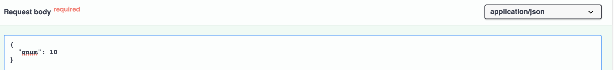

# Bewise.ai FastAPI PostgreSQL

Как использовать приложение:

Скопировать в любую папку файл docker-compose.yml и выполнить команду:
```python
docker-compose -f docker-compose.yml up -d
```
[](images/img_01.png)

Далее перейти в браузере на адрес
http://localhost:8000/:

[](images/img_02.png)

Приложение ожидает post-запрос, переходим в /docs, тестируем работу:

[](images/img_03.png)
[](images/img_04.png)
[](images/img_05.png)
[](images/img_06.png)

Quiz API отдает пустой словарь если БД пуста.
При наличии записей в БД - последний добавленный вопрос. Задание выполнено.

## Примечания:

Приложение обрабатывает ошибку внешнего API:
```python
    except requests.exceptions.RequestException as e:
        raise SystemExit(e) from e
```

Уникальность записанных данных обеспечивается рекурсивным вызовом add_new_questions_to_db:
```python
        if question_exists(session=session, question=question):
            # print("duplicated question encountered")
            session.close()
            # new question search starts to avoid duplication
            substitute_question = get_questions(1)
            # recursive function call till unique question will be obtained and stored
            add_new_questions_to_db(questions=substitute_question, recursive=True)
```

Запрос последней записи производится перед обновлением БД однократно:
```python
     for i, q in enumerate(questions):
        answer: str = q["answer"]
        question: str = q["question"]
        # the last question is requested only once for a cycle
        if not recursive and i == 0:
            last_question = find_last_question(session=session)
            # print("search for last question done once for a cycle")
```

Для доступа к БД проброшен порт 9090:
```dockerfile
    ports:
      - "9090:5432"
```

В режиме development используется docker-compose.dev.yml.
Созданный с его помощью образ размещен на Docker Hub и подтягивается при запуске docker-compose.yml.

[](images/img_07.png)

[](images/img_08.png)

SQLAlchemy протестировано с помощью main:

```python
def main():
    """Main was used once only for db operations testing"""

    session: scoped_session = Session()

    questions = get_all_questions(session)
    for q in questions:
        delete_question(session, q)

    create_question(session, "How are you?", "Thanks, fine")
    create_question(session, "Are you ready?", "Yes, I am")

    questions = get_all_questions(session)
    for q in questions:
        print(q.question, q.answer)
        print(question_exists(session=session, question=q.question))
        print(question_exists(session=session, question="Test question"))

    session.close()
```

Внешнее API jservice.io тестировалось вручную запросом пакета из 10, 100 вопросов:

[](images/img_09.png)

Pylint тест пройден.
